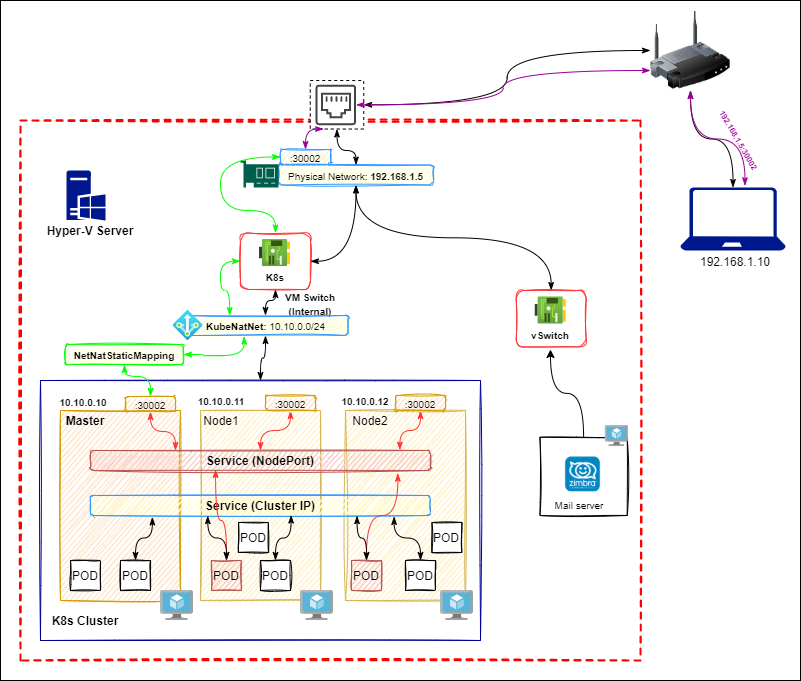

# Architecture overview



# Download Nginx for Windows

This is my pre-compile with modules: `--with-stream_ssl_module` and `--with-stream_ssl_preread_module`

```cmd
C:\nginx>nginx -V
nginx version: nginx/1.20.0
built by cl 19.16.27045.0
built with OpenSSL 1.1.1k  25 Mar 2021
TLS SNI support enabled
configure arguments: --with-cc=cl --builddir=objs --prefix= --conf-path=conf/nginx.conf --pid-path=logs/nginx.pid --http-log-path=logs/access.log --error-log-path=logs/error.log --sbin-path=nginx.exe --http-client-body-temp-path=temp/client_body_temp --http-proxy-temp-path=temp/proxy_temp --http-fastcgi-temp-path=temp/fastcgi_temp --http-scgi-temp-path=temp/scgi_temp --http-uwsgi-temp-path=temp/uwsgi_temp --with-cc-opt=-DFD_SETSIZE=1024 --with-pcre=objs/lib/pcre-8.44 --with-zlib=objs/lib/zlib-1.2.11 --with-openssl=objs/lib/openssl-1.1.1k --with-openssl-opt='no-asm no-tests' --with-http_addition_module --with-http_v2_module --with-http_realip_module --with-http_sub_module --with-http_dav_module --with-http_stub_status_module --with-http_flv_module --with-http_mp4_module --with-http_gunzip_module --with-http_gzip_static_module --with-http_auth_request_module --with-http_random_index_module --with-http_secure_link_module --with-http_slice_module --with-mail --with-stream --with-http_ssl_module --with-mail_ssl_module --with-stream_ssl_module --with-stream_ssl_preread_module
```

```powershell
Invoke-WebRequest -Uri 'https://raw.githubusercontent.com/nvtienanh/hyperv-k8s/main/nginx/nginx.zip' -OutFile 'C:\nginx.zip'
Expand-Archive -LiteralPath 'C:\nginx.zip' -DestinationPath C:\
Remove-Item 'C:\nginx.zip'
```

# Run nginx as a service

By default nginx/Windows runs as a standard console application. I'm using Windows Service Wrapper to make it run as a service

## Install 

```powershell
Invoke-WebRequest -Uri https://github.com/winsw/winsw/releases/download/v2.11.0/WinSW-x64.exe -OutFile 'C:\nginx\nginx-service.exe'
```

Create file `nginx-service.xml` in `C:\nginx`

```xml
<configuration>
  <id>nginx</id>
  <name>nginx</name>
  <description>nginx</description>
  <executable>%BASE%/nginx.exe</executable>
  <stopexecutable>%BASE%/nginx.exe -s stop</stopexecutable>
  <logpath>%BASE%/logs/</logpath>
  <logmode>roll</logmode>
  <depend></depend>
</configuration>
```

## Install nginx service

```powershell
cd C:\nginx
.\nginx-service.exe install
net start nginx 2>&1 | % { $_.ToString() }
```

## Auto start nginx when window startup

Create file `C:\nginx\startup.ps1`

```powershell
net start nginx 2>&1 | % { $_.ToString() }
```

Add Scheduled Job

```powershell
$trigger = New-JobTrigger -AtStartup -RandomDelay 00:00:30
Register-ScheduledJob -Trigger $trigger -FilePath C:\nginx\startup.ps1 -Name StartNginx
```

# Enable Firewall

```powershell
New-NetFirewallRule -DisplayName "Allow HTTP and HTTPs over Nginx" -Group "NGINX Reverse Proxy" -Direction Inbound -Action Allow -EdgeTraversalPolicy Allow -Protocol TCP -LocalPort 80,443 -Program "C:\nginx\nginx.exe"
```

# Video demo

- [Deploy Kubernetes Nginx Ingress + MetalLB load-balancer](https://www.youtube.com/watch?v=LbLaCVaX73E)
